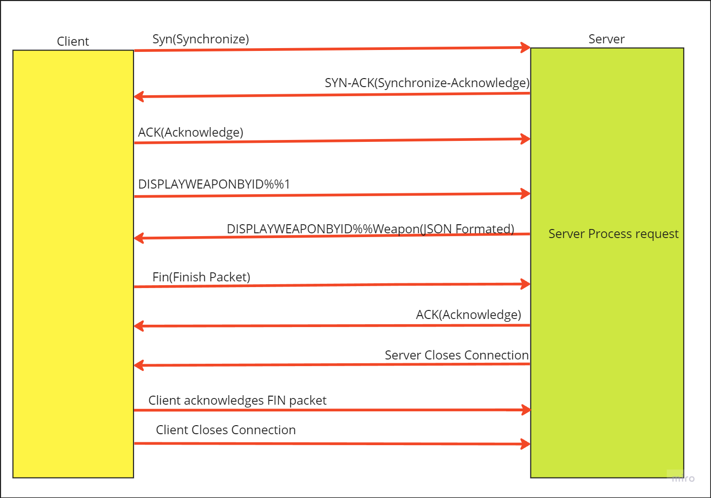

# Database-Driven-Client-Server-Application
This Repo holds the Code for my Ca6, this project is a database driven client server application that stores information
about weapon to be used in a video game.
I learned the following:
* How to use the TCP protocol to communicate between a client and server
* How to use the JDBC API to connect to a database
* How to utilise the Command design pattern
* How to use the DAO design pattern
* How to utilise JSON to send data between a client and server

The issues I faced during this assignment were:
* I had issues with the TCP protocol, I was not sure how to properly close the connection between the client and server
* I had issues with the DAO design pattern, when accessing a normailzed database
Overall I enjoyed this assignment, I learned a lot about the TCP protocol and how to use it to communicate between a client and server.
I feel like I have a better understanding of the DAO design pattern and how to use it to access a database.
I also feel like I have a better understanding of the Command design pattern and how to use it to send data between a client and server.

<h1>Network Sequence Diagram</h1>

<h1>Architecture</h1>

